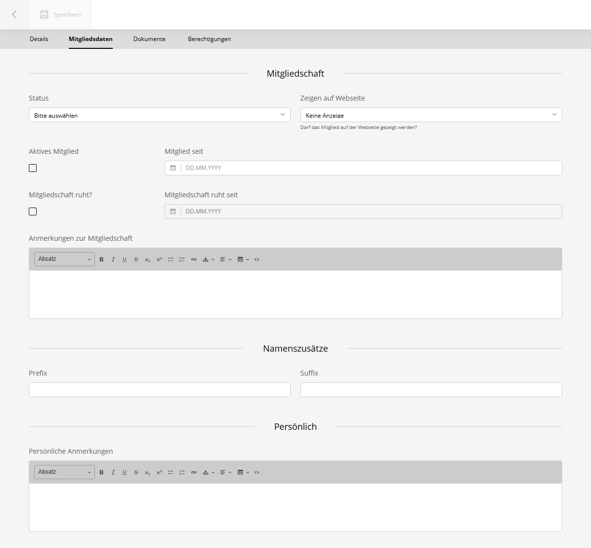

# SuluAssociationContactBundle

<a href="https://github.com/manuxi/SuluAssociationContactBundle/blob/main/LICENSE" target="_blank">

</a>
<a href="https://github.com/manuxi/SuluAssociationContactBundle/tags" target="_blank">

</a>

Ein Sulu-CMS-Bundle zur Verwaltung von Vereins- und Mitgliedschaftseigenschaften bei Kontakten.
Es fügt im Sulu-Admin einen zusätzlichen Tab zum Kontakt-Bearbeitungsformular hinzu, mit Feldern wie Mitgliedsstatus, Mitgliedschaftsdaten, Anzeige-Einstellungen und mehr.



**English?** See [README.md](README.md)

## Voraussetzungen

- PHP >= 8.2
- Sulu >= 3.0
- Symfony >= 7.0

## Installation

Paket installieren:
```console
composer require manuxi/sulu-association-contact-bundle
```

Falls Symfony Flex *nicht* verwendet wird, muss das Bundle in `config/bundles.php` eingetragen werden:

```php
return [
    //...
    Manuxi\SuluAssociationContactBundle\SuluAssociationContactBundle::class => ['all' => true],
];
```

Folgendes in `config/routes/sulu_association_contact_admin.yaml` eintragen:
```yaml
SuluAssociationContactBundle:
    resource: '@SuluAssociationContactBundle/Resources/config/routes_admin.yaml'
```

Datenbankschema aktualisieren:

```bash
# SQL-Anweisungen anzeigen
php bin/console doctrine:schema:update --dump-sql

# Änderungen ausführen
php bin/console doctrine:schema:update --force
```

Dabei sicherstellen, dass nur die Schema-Änderungen dieses Bundles verarbeitet werden!

## Konfiguration

Es ist keine weitere Konfiguration erforderlich. Das Bundle registriert die notwendigen Services und Formulare automatisch.
