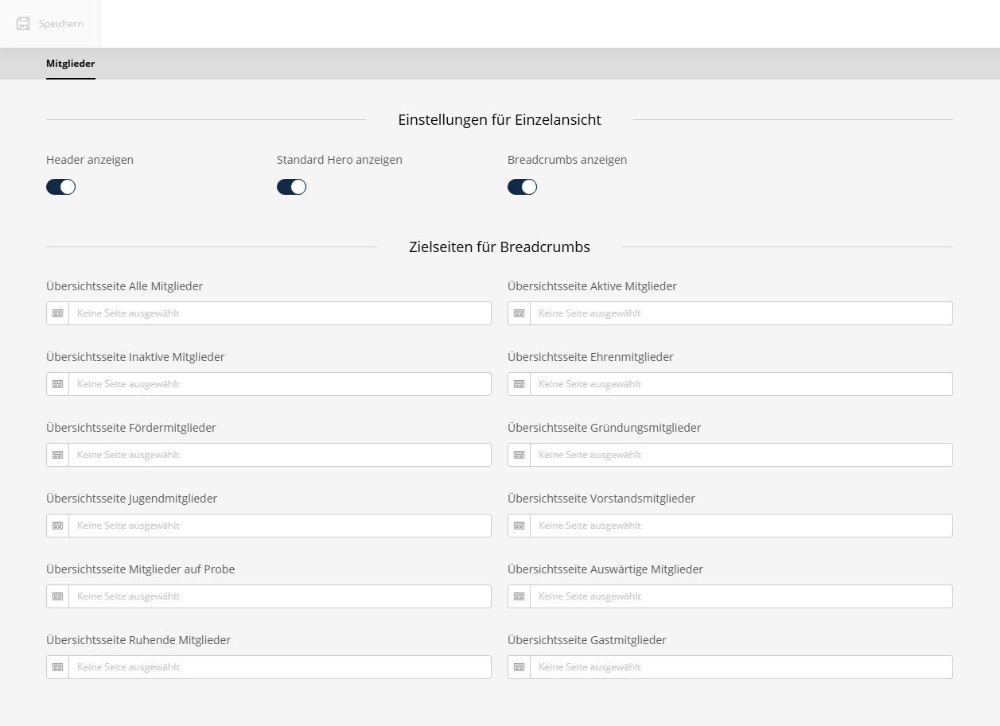

# Einstellungen

Die Einstellungen des Bundles sind im Sulu-Admin unter **Kontakte > Einstellungen** erreichbar.


## Allgemeine Einstellungen

| Feld | Beschreibung |
|---|---|
| **Header anzeigen** | Schaltet den Header in der Einzelansicht ein/aus |
| **Standard Hero anzeigen** | Schaltet den Hero-Bereich in der Einzelansicht ein/aus |
| **Breadcrumbs anzeigen** | Schaltet die Breadcrumb-Navigation in der Einzelansicht ein/aus |

## Zielseiten für Breadcrumbs

Hier können für jeden Mitgliedsstatus eigene Übersichtsseiten hinterlegt werden. Diese werden z.B. für die Breadcrumb-Navigation auf den Einzelseiten der Mitglieder verwendet.

| Feld | Beschreibung |
|---|---|
| **Übersichtsseite Alle Mitglieder** | Hauptseite für alle Mitglieder |
| **Übersichtsseite Aktive Mitglieder** | Zielseite für aktive Mitglieder |
| **Übersichtsseite Passive Mitglieder** | Zielseite für passive Mitglieder |
| **Übersichtsseite Ehrenmitglieder** | Zielseite für Ehrenmitglieder |
| **Übersichtsseite Fördermitglieder** | Zielseite für Fördermitglieder |
| **Übersichtsseite Gründungsmitglieder** | Zielseite für Gründungsmitglieder |
| **Übersichtsseite Jugendmitglieder** | Zielseite für Jugendmitglieder |
| **Übersichtsseite Vorstandsmitglieder** | Zielseite für Vorstandsmitglieder |
| **Übersichtsseite Mitglieder auf Probe** | Zielseite für Probemitglieder |
| **Übersichtsseite Auswärtige Mitglieder** | Zielseite für auswärtige Mitglieder |
| **Übersichtsseite Ruhende Mitglieder** | Zielseite für ruhende Mitglieder |
| **Übersichtsseite Gastmitglieder** | Zielseite für Gastmitglieder |

## Twig-Zugriff

Die Einstellungen können in Twig-Templates über die Funktion `association_contacts_settings()` abgerufen werden:

```twig



    {# Header anzeigen #}



```
